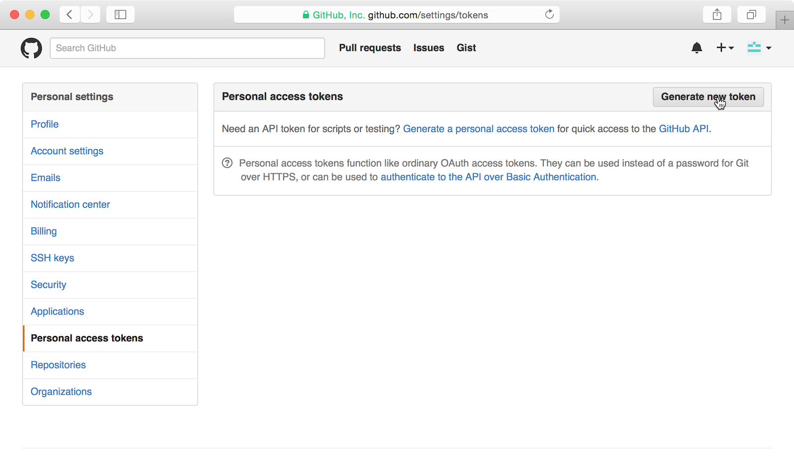
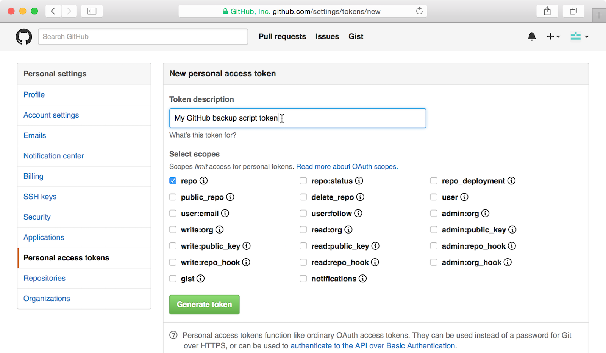
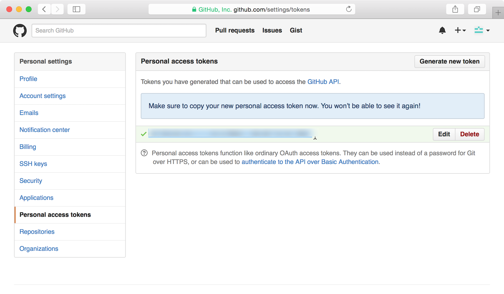
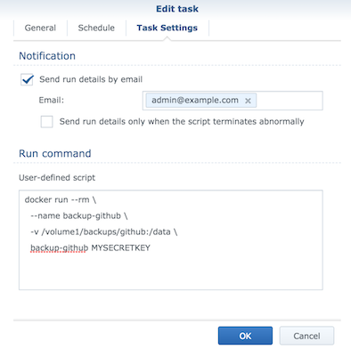

# Introduction

Based upon the work of [abusesa](https://github.com/abusesa/github-backup)

We changed the initial setup to meet our requirement to run the backup inside a docker container on a Synology NAS.

# Table of Contents

- [Introduction](#introduction)
- [Table of Contents](#table-of-contents)
- [Prerequisites](#prerequisites)
    - [Create a token](#create-a-token)
- [Installation](#installation)
- [Run](#run)
  - [Synology](#synology)
- [Operational](#operational)
- [References](#references)

# Prerequisites

### Create a token

For authorization you need to create a new personal GitHub token. You can do this from the GitHub settings, under the **Personal Access Tokens** tab.



When you click the **Generate new token** button you enter the token creation screen. Here you should give the token a descriptive name and choose its *scopes*, which basically determine what the token is allowed to do.



To backup public and private repositories you need to select only the **repo** scope. If you have no need for private repositories just choose the **public_repo** scope.



After clicking the **Generate token** button you're presented with the generated token. Remember to store it now, as GitHub won't show it to you anymore!

In the next example let's assume your token is ```githubtoken123```.

# Installation

Clone this repository and build the docker container:

First build the docker container:

```bash
git clone git@github.com:riklempens/docker.backup-github.git
cd docker.backup-github
docker build --no-cache -t backup-github .
```

# Run

Start the docker container, please note you should adjust the volume mapping to your own needs.

```bash
docker run --rm \
  --name backup-github \
  -v /volume1/backups/github:/data \
  backup-github githubtoken123
```

## Synology

We use Synology's task scheduler to make a daily backup of all GitHub repositories.




**IMPORTANT**

1. Be aware that anyone who can access the Synology NAS can potentially retrieve the token.
2. Ensure the backup's are stored on an encrypted volume.

# Operational

Check the progress of the backup:

```bash
docker logs -f backup-github
```

# References

* [abusesa](https://github.com/abusesa/github-backup)
* [Docker suppurt Synology](https://www.synology.com/en-global/dsm/feature/docker)
